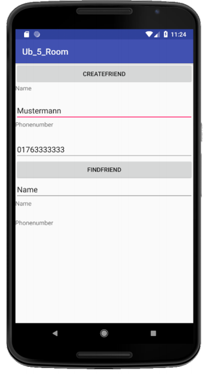

# U06 | Telefonbuch


## Downloads

- [Download des Starterpakets](https://github.com/Android-Regensburg/U06-Telefonbuch/archive/master.zip)
- [Download des Lösungsvorschlag](https://github.com/Android-Regensburg/U06-Telefonbuch/archive/solution.zip)

## Aufgabe

Schreiben Sie eine einfache Datenbank-App, welche die Namen und Telefonnummern Ihrer Freunde
speichert. Benutzen Sie eine Activity und `EditText`-Views um die Eingabe zu ermöglichen, sowie
weitere `Views` und Buttons für die beschriebenen Funktionen. Nutzern soll es möglich sein, sich die
Telefonnummer anzeigen zu lassen, indem sie den passenden Namen eingeben.

## Hinweise

* Stellen Sie sicher, dass bei der Eingabe der Telefonnummer nur Zahlenwerte eingegeben
werden können.
http://developer.android.com/reference/android/R.attr.html#inputType

* Das Layout ist bereits erstellt und referenziert und kann somit benutzt werden

* Falls der Nutzer nach einem Namen sucht, der nicht in der Datenbank hinterlegt ist, wird ein
null-Wert zurückgegeben. Achten Sie bei der Datenbankabfrage auf mögliche Komplikationen
und fangen Sie diese ab.

* Datenbankabfragen müssen in einem eigenen Thread erfolgen, um die MainActivity nicht zu
blockieren.
https://developer.android.com/training/data-storage/room/accessing-data

* In den einzelnen Klassen müssen Sie die passenden Datenpakete von Room laden.

## Vorgehen

### Referenzieren Sie die Layout-Elemente in der MainActivity

1. Belegen Sie die Buttons mit neuen `onClick`-Listener

2. Schreiben Sie eine Methode `enterNewIntro()`, welche die Nutzereingaben in einen String
(Name) und einen int (Telefonnummer) umwandelt, um einen neuen Kontakt zu erstellen

3. Schreiben Sie eine Methode `findFriend()`, welche den eingegebenen Namen in einen String
umwandelt, um damit später eine Telefonnummer suchen zu können

4. Rufen Sie diese beiden Methoden in den `onClick()`-Methoden der Buttons auf.

### Datenbank erstellen

1. Fügen Sie folgende gradle-Abhängigkeiten der build.gradle-Datei hinzu:
```
implementation “android.arch.persistence.room:runtime:1.0.0”
annotationProcessor “android.arch.persistence.room:compiler:1.0.0”
```

2. Erstellen Sie eine Klasse `Friend`, welche einen Eintrag im Telefonbuch beschreibt

    a.  Erstellen Sie den Header der Klasse und annotieren Sie diese mit `@Entity`.

    b. Erstellen Sie Variablen `friendId`, `friendName` und `phoneNumber`. Stellen Sie sicher, dass die Id nicht null wird (`@NonNull`) und sich selbst inkrementiert(`@PrimaryKey(autoGenerate = true)`).

    c. Erstellen Sie einen leeren Konstruktor

    d. Erstellen Sie getter- und setter-Methoden und geben Sie Ihnen das Attribut `@NonNull`.

    e. Nutzen Sie dazu die Generate-Möglichkeit von Android Studio (Alt+Einfg) (Rechtsklick, generate)

    Erstellen Sie ein Interface DaoAccess für die Datenbankabfrage 

    f. Erstellen Sie den Header der Interface-Klasse und annotieren Sie das Interface mit `@Dao`.

    g. Schreiben Sie eine insert-Methode, welche einen neuen Freund in die Datenbank einfügt. Schreiben Sie nur den Header der Methode und `@Insert` darüber.

    h. Schreiben Sie eine query-Methode `fetchOneFriendbyFriendName()`, welche als Rückgabetyp `Friend` hat. Schreiben Sie die SQL-Abfrage `@Query ("SELECT * FROM friend WHERE friendName = :friendName")` darüber.

3. Erstellen Sie eine Klasse, welche die Datenbank darstellt. 

    a. Erstellen Sie eine abstrakte Klasse `FriendDatabase` welche von `RoomDatabase` erbt.

    b. Annotieren Sie die Datenbankklasse mit `@Database(entities = {Friend.class}, version = 1, exportSchema = false)` über dem Klassen-Header

    c. Erstellen Sie die Methodensignatur für die Rückgabe des Data Access Object Interface `DaoAcess: public abstract DaoAccess daoAccess();`

### Datenbank in MainActivity einbinden

1. Erstellen Sie eine Instanz der Datenbank in der `MainActitivity`

    a. Erstellen Sie eine Variable `FriendDatabase` mit dem Namen `friendDatabase`

    b. Speichern Sie in der Variable `friendDatabase` den Rückgabewert des Aufrufs `Room.databaseBuilder(…)`. Die Variable enthält nun eine Referenz auf ein neues Datenbankobjekt.

    c. Speichern Sie den Namen der Datenbank in einer Konstante. Die Datenbank muss implementiert werden, sobald die App startet

2. Speichern Sie die Nutzereingabe in der Datenbank.

    a. Erstellen Sie in der von Ihnen erstellte Methode `enterNewIntro()` einen neuen Thread.

    b. Lassen Sie sich mittels der `DaoAccess` Methode `friendDatabase.daoAccess().fetchOneFriendByFriendName(friendname)` den gesuchten Friend zurückgeben.

    c. Stellen Sie sicher, dass der Rückgabewert nicht null ist und lassen sich den Namen und die Telefonnummer des `Friends` mittels der getter-Methoden zurückgeben.

    d. Zeigen Sie Name und Telefonnummer in den passenden `TextViews` an

## Anhang

### Screenshots

